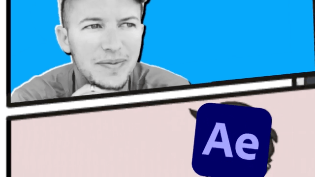
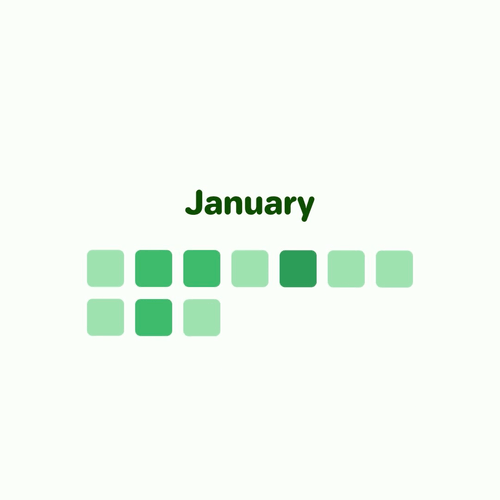

<p align="center">
  <a href="https://github.com/remotion-dev/logo">
    <picture>
      <source media="(prefers-color-scheme: dark)" srcset="https://github.com/remotion-dev/logo/raw/main/animated-logo-banner-dark.gif">
      
    </picture>
  </a>
</p>

[](https://remotion.dev/discord)
[](https://www.npmjs.org/package/remotion)
[](https://npmcharts.com/compare/remotion?minimal=true)
[](https://packagephobia.now.sh/result?p=remotion)
<a href="https://twitter.com/remotion_dev"></a>

Remotion is a framework for **creating videos programmatically using React.**

## Why create videos in React?

- **Leverage web technologies**: Use all of CSS, Canvas, SVG, WebGL, etc.
- **Leverage programming**: Use variables, functions, APIs, math and algorithms to create new effects
- **Leverage React**: Reusable components, Powerful composition, Fast Refresh, Package ecosystem

## Created with Remotion

<table>
<tr>
<td>

<p>"This video was made with code" <em>- Fireship</em> <a href="https://youtu.be/deg8bOoziaE">Watch</a> • <a href="https://github.com/wcandillon/remotion-fireship">Source</a></p>
</td>
<td>

<p>GitHub Unwrapped - Personalized year in Review <a href="https://githubunwrapped.com">Try</a> • <a href="https://github.com/remotion-dev/github-unwrapped">Source</a></p>
</td>
<td>
<em>View more in the <a href="https://remotion.dev/showcase">Remotion Showcase</a>!</em>
</td>
</tr>
</table>

See even more creations in the [Showcase](https://remotion.dev/showcase).

## Get started

If you already have Node.JS installed, type

```console
npm init video
```

to get started. Otherwise, read the [installation page](https://www.remotion.dev/docs/) in the documentation.

## Documentation

Documentation: [**remotion.dev/docs**](https://www.remotion.dev/docs)  
API Reference: [**remotion.dev/api**](https://www.remotion.dev/api)

## License

Be aware of that Remotion has a special license and requires obtaining a company license in some cases. Read the [LICENSE](LICENSE.md) page for more information.

## Contributing

Please read [CONTRIBUTING.md](CONTRIBUTING.md) to learn about contributing to this project.
