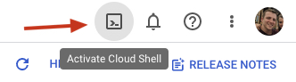

from the root, `pnpm i && pnpm build` will trigger a build command for all packages. For the GCP package, this will bundle the required code into `cloudrun/container`.

The /container folder contains a package.json that lists functions-framework as a dependency, and a Dockerfile that will build the container. Functions-framework is a nodejs framework that allows you to run nodejs code in a containerized environment.

This can be built and deployed to Cloud Run. Cloud Run is a serverless container platform that allows you to run containers in a managed environment.

## Deploying new artifact repo in GCP for new Remotion versions

Public artifact registry that contains the container images
us-docker.pkg.dev/remotion-dev/cloud-run/render
Image is tagged with the same semver as the remotion packages
us-docker.pkg.dev/remotion-dev/cloud-run/render:3.3.36-alpha
Part of the CI/CD pipeline should be to push a new container image to the artifact registry, with the right version:
`gcloud builds submit --tag us-docker.pkg.dev/remotion-dev/cloud-run/render:${version}`

# How to use the GCP CLI commands

## 1. Create a project in the Google Cloud Console

Navigate to the [Manage Resources](https://console.cloud.google.com/cloud-resource-manager?walkthrough_id=resource-manager--create-project&start_index=1#step_index=1) screen in Google Cloud Console.

- On the Select organization drop-down list at the top of the page, select the organization resource in which you want to create a project. If you are a free trial user, skip this step, as this list does not appear.
- Click Create Project.
- In the New Project window that appears, enter a project name and select a billing account as applicable. A project name can contain only letters, numbers, single quotes, hyphens, spaces, or exclamation points, and must be between 4 and 30 characters.
- Enter the parent organization or folder resource in the Location box. That resource will be the hierarchical parent of the new project. If No organization is an option, you can select it to create your new project as the top level of its own resource hierarchy.
- When you're finished entering new project details, click Create.

## 2. Enable billing in the GCP Project

In order to enable the Cloud Run API, billing must be enabled in this project. Navigate to the [Billing](https://console.cloud.google.com/billing) screen in Google Cloud Console. Follow the on-screen prompts to create a billing account, and then link the new project to this billing account.

## 3. Setup Permissions / APIs / Service Account in GCP

This can be achieved by either following the instructions for using Terraform within GCP Cloud Shell (recommended) or following the instructions for clicking through the GCP Console. The former is the preferred method as it minimises the risk of missing an instruction.

### Using Terraform within GCP Cloud Shell:

_Note, this process does not require an understanding of Terraform._

**What is Google Cloud Shell?**  
Google Cloud Shell is a browser-based command-line interface (CLI) for managing resources and applications hosted on Google Cloud Platform (GCP). It provides a virtual machine with pre-installed command-line tools and utilities, including the Google Cloud SDK and Terraform.

Google Cloud Shell is fully integrated with GCP, which means that you can access your projects, resources, and services directly from the command line without having to switch between multiple interfaces. Additionally, Cloud Shell offers a persistent disk for storing your data and files, as well as a web-based code editor for editing files and running scripts.

This means that you can clone a github repo, run a couple of Terraform commands, and have a Remotion ready GCP project in minutes 🚀.

1. In the top right hand corner of the screen, click the Activate Cloud Shell icon  
   
2. Within the Cloud Shell, type  
`git clone https://github.com/UmungoBungo/remotion-gcp-terraform.git remotion-gcp-terraform/`
<!-- ToDo - host this in the official Remotion repo -->
3. Change directory into the new folder  
   `cd remotion-gcp-terraform/`
4. Within the terraform file, there is a variable named project_id. This needs to be set to your newly created Remotion project. Because we are already authenticated with GCP when using the Cloud Shell, we can set this variable using the following command:
   `export TF_VAR_project_id=$(gcloud config get-value project)`
5. As terraform is natively available in Cloud Shell, we can begin using terraform commands without further installation. Run the following command;  
    `terraform init`  
   _Explanation: When you run `terraform init`, Terraform will download any required provider plugins and modules and create a .terraform directory in your working directory._
6. Run the following command;  
    `terraform plan`  
   _Explanation: When you run `terraform plan`, Terraform checks your code to see what resources you're trying to create, update or delete, and then shows you what it will do without actually making any changes._
7. Check the output from the above to ensure you are happy with the changes about to be made to your project. If so, run the following command;  
    `terraform apply`  
   _Explanation: When you run `terraform apply`, Terraform deploys the resources as defined in the .tf files._
8. When the apply is complete, it will output a script to run in the command line. Running this will create a key for the service account and store it on the virtual machine. **Note that these keys need to remain secret.** The command should look similar to the following;  
   `gcloud iam service-accounts keys create key.json --iam-account=remotion-sa@<project_name>.iam.gserviceaccount.com`
9. The key file has been generated on the virtual machine. You can now build the .env file that is needed at the root of your Remotion project in order to interact with GCP. Run the following command;
   ```
   echo "REMOTION_GCP_PRIVATE_KEY=$(jq '.private_key' key.json)" >> .env && \
   echo "REMOTION_GCP_CLIENT_EMAIL=$(jq '.client_email' key.json)" >> .env && \
   echo "REMOTION_GCP_PROJECT_ID=$(gcloud config get-value project)" >> .env
   ```
10. Download the .env file by clicking the vertical ellipsis, in the top right of the cloud shell window, and selecting Download. Then type .env at the end of the prefilled path, and click DOWNLOAD;  
    

    

11. Remove the .env file and key.json from the virtual machine, using this command;  
    `rm key.json .env`

12. Place the .env file you've downloaded into the root of your Remotion project. You may need to rename it from `env.txt`, to `.env`.

### Clicking through the console:

### 1. Create a new role with permissions required by the service account

Navigate to the [Role](https://console.cloud.google.com/iam-admin/roles) screen in Google Cloud Console, within IAM & Admin.

- Select the Cloud project created in the previous step.
- Click + CREATE ROLE in the top menu.
- Under Title, type: `Remotion API Service Account`
- Under Description, type: `Allow the service account to manage necessary resources for Remotion Cloud Run rendering.`
- Under ID, type: `RemotionSA`
- For Role launch stage, select `General Availability`
- Click + Add Permissions, and add the following;
  - iam.serviceAccounts.actAs
  - run.operations.get
  - run.routes.invoke
  - run.services.create
  - run.services.list
  - run.services.update
  - storage.buckets.get
  - storage.buckets.list
  - storage.objects.create
  - storage.objects.delete
  - storage.objects.list
  - run.services.getIamPolicy
  - run.services.setIamPolicy
- Click the CREATE button

#### 1a. Permission reasons

For information only, here are the reasons for the above permissions

- iam.serviceAccounts.actAs
  - When deploying, act as the default service account, which will grant further permissions required during deployment.
- run.operations.get
  - Required during deployment to confirm that deployment was successful.
- run.routes.invoke
  - Call the deployed Cloud Run services, in order to perform a render.
- run.services.create
  - Deploy new, and edit existing, Cloud Run services
- run.services.list
  - Get a list of existing Cloud Run services, to ensure no unintended overwriting.
- run.services.update
  - Update a Cloud Run service, for instance providing it with more Memory or CPU.
- storage.buckets.get
  - ToDo...
- storage.buckets.list
  - Get a list of existing Cloud Storage resources, to ensure no unintended overwriting of storage buckets.
- storage.objects.create
  - Create new objects in storage. This could be bundled sites, or renders, or logs.
- storage.objects.delete
  - ToDo...
- storage.objects.list
  - ToDo...
- run.services.getIamPolicy
  - used to check the existing IAM policy on a service
- run.services.setIamPolicy
  - used to set the IAM policy on a service

### 2. Create a service account in the Google Cloud Console

Navigate to the [Service Accounts](https://console.cloud.google.com/projectselector2/iam-admin/serviceaccounts/create) screen in Google Cloud Console, within IAM & Admin.

- Select the Cloud project created in the previous step.
- Enter a service account name to display in the Google Cloud console.
- The Google Cloud console generates a service account ID based on this name. Edit the ID if necessary. You cannot change the ID later.
- Optional: Enter a description of the service account.
- Click 'Create and continue' and continue to the next step.
- Give the Service Account the role created in the previous step, Remotion API Service Account.  
  
- Click Done to finish creating the service account.

### 3. Save Service Account credentials

Navigate to the [Service Accounts](https://console.cloud.google.com/iam-admin/serviceaccounts) screen in Google Cloud Console, within IAM & Admin.

- Select the Cloud project created in the previous step.
- Click on the ellipsis under 'Actions', in the final column, and click 'Manage keys'.
- On the next screen, click ADD KEY, and then Create new key.
- select JSON, and click Create.
- Save the JSON file to your computer, and open it.
- Create/edit a .env file in the root of your Remotion project.
  - Create a REMOTION*GCP_CLIENT_EMAIL key, and copy over the client_email value, \_including the quotation marks*.
  - Create a REMOTION*GCP_PRIVATE_KEY key, and copy over the private_key value, \_including the quotation marks*.

### 5. Set Remotion Project ID in .env

- Within the previously edited .env file in the root of your Remotion project, create a REMOTION_GCP_PROJECT_ID key, and set the key as the ID from the [Dashboard](https://console.cloud.google.com/home/dashboard), under the Project Info card.

### 4. Enable required APIs in the project

- Enable the Cloud Run API. Navigate to the [Cloud Run API](https://console.cloud.google.com/apis/library/run.googleapis.com) screen in Google Cloud Console, and click ENABLE. Make sure the correct project is selected in the dropdown in the top left. This is required in order to use Cloud Run.

# Available commands from the CLI:

This command will deploy a cloud-run service, and return the URL of the service. This cloud run service is what will be invoked to render media.  
<br><br>

### Command: `npx remotion gcp cloud-run deploy`

Options:

- --project-id (required):
  - The project-id is the name of the project in which to deploy the service. The ID can be retrieved by navigating to the [Dashboard](https://console.cloud.google.com/home/dashboard) screen in Google Cloud Console, and selecting the project from the drop-down menu in the top left corner. The ID is under Project Info in the top left corner.
- --service-name (required):
  - the name of the Cloud Run service to deploy or update. Service names must be 49 characters or less and must be unique per region and project. A service name cannot be changed later and is publicly visible. The service does not need to exist yet. If it does exist, a new revision will be deployed.
- --region: the region of the service
- --overwrite-service (optional, default to false):
  - if an existing service is found with the same name, a prompt will come up asking if a new revision should be deployed. If this flag is set to true, the prompt will be skipped and a new revision will be deployed automatically.

Taking the above into account, a valid command would be:  
`npx remotion gcp cloud-run deploy --service-name=cloud-run-render --project-id=new-remotion-project`

To view the deployed service, navigate to the [Cloud Run](https://console.cloud.google.com/run) screen in Google Cloud Console, and selecting the project from the drop-down menu in the top left corner.

- The URL is visible at the top of the screen. This is where to send POST requests for rendering.
- Revisions are listed under the revisions tab. You can also manage traffic splitting, and view resource limits for each revision.
- Logs are available under the logs tab. For troubleshooting, it is best to click on the new tab icon to open the Logs Explorer, and then click on Stream Logs in the top right to have a live view of logs.

<br><br>

### Command: `npx remotion gcp sites create`

Options:

- tbc

This command will bundle the site and upload it to a GCP bucket. To view storage buckets in your project, navigate to the [Storage](https://console.cloud.google.com/storage/browser) screen in Google Cloud Console, and select the project from the drop-down menu in the top left corner.

# Render media on GCP

This command will render media on the deployed cloud-run service, and return metadata of the rendered file.

### Command: `pnpm exec remotion gcp render media <serve-url> <cloud-run-url> <composition-name> --output-bucket=<GCS-bucket-name>`

## Manually, making a post request

Within the Cloud Run service, you can see the URL of the service. Distributed rendering is not yet supported, but rendering a still or media in a single-threaded instance is available.

To render media, send a POST request to the URL with the following body:

- type: the type of render. For media, this should be set to `media`.
- composition: the name of the composition to render. This must be available in the bundle that has been deployed to GCP.
- serveUrl: the URL of the site that has been deployed to GCP.
- inputProps: the props to pass to the composition.
- outputBucket: bucket for the output to be uploaded to. The bucket must exist, and the service account running the service must have access to the bucket.
- outputFile: The path and filename to upload the output to.

```
{
    "type": "media",
    "composition": "HelloWorld",
    "serveUrl": "https://storage.googleapis.com/remotioncloudrun-n8x4pc7dz3/sites/e97ngid3n3/index.html",
    "codec": "h264",
    "inputProps": {
      "titleText": "Welcome to Remotion",
      "titleColor": "black"
    },
    "outputBucket": "remotionlambda-test",
    "outputFile": "outFolder/mediaOutput.mp4"
}
```

# Render still on GCP

This command will render media on the deployed cloud-run service, and return metadata of the rendered file.

### Command: `pnpm exec remotion gcp render still <serve-url> <cloud-run-url> <composition-name> --output-bucket=<GCS-bucket-name>`

## Manually, making a post request

To render a still, send a POST request to the URL with the following body:

- type: the type of render. For a still, this should be set to `still`.
- composition: the name of the composition to render. This must be available in the bundle that has been deployed to GCP.
- serveUrl: the URL of the site that has been deployed to GCP.
- inputProps: the props to pass to the composition.
- outputBucket: bucket for the output to be uploaded to. The bucket must exist, and the service account running the service must have access to the bucket.
- outputFile: The path and filename to upload the output to.

```
{
    "type": "still",
    "composition": "StillRender",
    "serveUrl": "https://storage.googleapis.com/remotioncloudrun-n8x4pc7dz3/sites/e97ngid3n3/index.html",
    "inputProps": {
      "text": "Created on Cloud Run™️"
    },
    "outputBucket": "remotionlambda-test",
    "outputFile": "outFolder/stillOutput.png"
}
```

## Using the CLI command, WIP

- 🟩 Render Media is largely finished
  - 🟩 Address comments within
- 🟩 Render Still command written
  - 🟩 Address comments within
- 🟩 Cloud Run render only ever puts the output in a bucket, not available for download.
  <br><br><br><br>

# To Do

### deploy cloud-run command

- add cpu and memory limit arguments
- returning error from deployNewCloudRun - typed as any, can I get a type from the protos?
- sprinkle quietFlagProvided() throughout
- when deploying a cloud run instance, should include the remotion version in the revision name
- add new service account as runner of the service, so the permissions can stay tight.
- allow outputBucket and outputFile to be optional. After that, update readme with details.
- add LS, RM, RMALL subcommands

### create sites command

- sprinkle quietFlagProvided() throughout
- time for uploading to GCP Storage Bucket is always 0ms
- add LS, RM, RMALL subcommands

### Render command

- Create API that just makes a post request to Cloud Run, to perform render
- Use lambda one for inspiration
