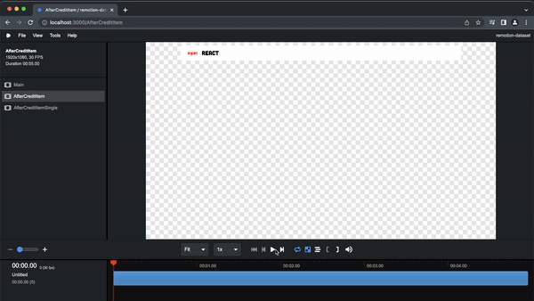
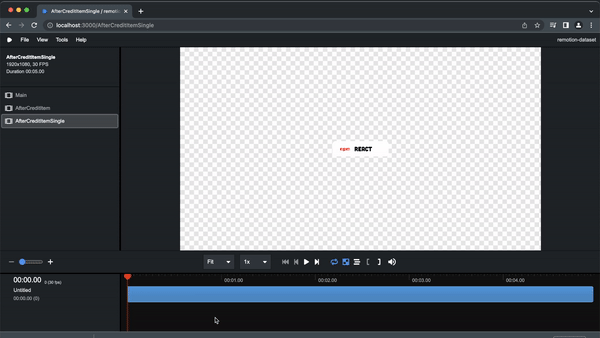
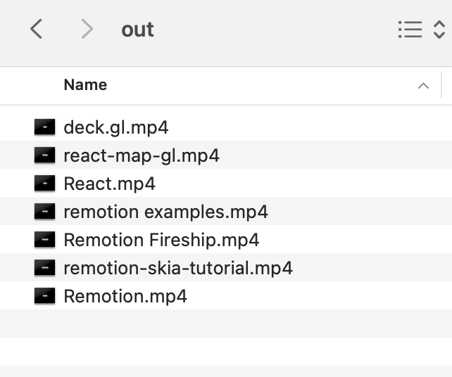

import { Player } from "@remotion/player";
import {JsonAsDSAllItems, JsonAsDSItem, RenderVideo} from "../components/JsonAsDatasetPlayer";

Example usage of a Dataset or sets of record in Remotion. The dataset is a collection of package or tutorial used in project.


## Completed video with all after credits 
 <JsonAsDSAllItems />

### Individual after credit
 <JsonAsDSItem />


## Problem
How to individually extract a video with different parameter from a set of records.

## Solution
Create a separate process to bundle the remotion project, pass the data and render video separately using node js. We will be leveraging `@remotion/renderer` package and [render video in nodejs ](https://www.remotion.dev/docs/ssr/#render-a-video-using-nodejs-apis).


## Work out the solution

#### This assumes that you already bootstrapped you're remotion project

### Create a JSON structure

Let's start a simple json record that represents data that needs to automatically animated.
The record contains bill of materials or credits to project that is used to create a remotion video, in movies an after credits.


### Sample json record

1. Record that is installed in the npm project

```json
  {
    "name": "React",
    "source_type": "npm",
    "metadata": {
      "project_url": "https://reactjs.org/"
    }
  }
```
2. Another record from github that we learned a technique or inspiration.

```json
  {
    "name": "Remotion Fireship",
    "source_type": "github",
    "metadata": {
      "project_url": "https://github.com/wcandillon/remotion-fireship"
    }
  }
```

### Parameter types
``` tsx twoslash
interface MetadataType {
  cover_url?: string;
  project_url: string;
}

interface AfterCreditType {
  name: string;
  source_type: string;
  metadata: MetadataType,
  isSingle?: boolean,
}


export {
  MetadataType,
  AfterCreditType
}

```

This represents the json into React parameter types

### Individual After Credit

``` tsx title="AfterCreditItem.tsx"
import { AbsoluteFill, spring, useCurrentFrame, useVideoConfig } from "remotion";
import Description from "./Description";
import SourceType from "./SourceType";
import { AfterCreditType } from "./types";

type Props = {
  children?: JSX.Element | JSX.Element[];
};


const Single: React.FC<Props> = ({ children }) => {
  return <AbsoluteFill
    style={{
      display: 'flex',
      alignContent: 'center',
      justifyContent: 'center',
      justifyItems: "center",
    }}
  >
    <div style={{
      display: 'flex',
      alignContent: 'center',
      justifyContent: 'center',
      justifyItems: "center",

    }}>


      {children}
    </div>
  </AbsoluteFill>
}

const AfterCreditItem: React.FC<AfterCreditType> = ({ name, source_type, metadata, isSingle }) => {
  const frame = useCurrentFrame();
  const { fps } = useVideoConfig();

  const scale = spring({
    fps,
    frame: frame + 10,
    durationInFrames: 25,
    config: {
      damping: 100
    }
  });


  return (

    <div style={{
      transform: `scale(${scale})`,
      backgroundColor: "white",
      height: '100px',
      margin: '10px',
      display: 'flex',
      paddingLeft: 50,
      paddingRight: 50,
      fontFamily: "Cubano",
      fontWeight: "bold",
      fontSize: '50px',
      borderRadius: '20px',
      justifyItems: 'center',
      alignItems: 'center',
    }}>
      <SourceType sourceType={source_type} />
      <Description name={name} metadata={metadata} />
    </div>
  )
}

const Main: React.FC<AfterCreditType> = (credit) => {

  if (credit.isSingle)
    return (
      <Single>
        <AfterCreditItem {...credit} />
      </Single>
    )

  return (
    <AfterCreditItem {...credit} />
  )

}

export default Main;

```

The component contains simple animation, using the `scale` in the `div` layer. The `Description` component also has it's animation. Full code in here [description](#the-description).




The `Single` component will center the `After Credit item` if we pass a `true` value to parameter `isSingle`.




### Rendering individual after credit

Let's start with creating a separate typescript file. Adapted from remotion documentation with tweaks.

```tsx title="render.tsx"
import path from "path";
import { bundle } from "@remotion/bundler";
import { getCompositions, renderMedia } from "@remotion/renderer";
import { AfterCreditType } from "./AfterCredits/types";
import afterCredits from "./AfterCredits/creditsdata.json"


const renderOne = async (credit: AfterCreditType, bundleLocation: string, compositionId: string, entry: String) => {
    // Parametrize the video by passing arbitrary props to your component.

    // Extract all the compositions you have defined in your project
    // from the webpack bundle.
    const comps = await getCompositions(bundleLocation, {
        // You can pass custom input props that you can retrieve using getInputProps()
        // in the composition list. Use this if you want to dynamically set the duration or
        // dimensions of the video.
        inputProps: credit,
    });

    // Select the composition you want to render.
    const composition = comps.find((c) => c.id === compositionId);

    // Ensure the composition exists
    if (!composition) {
        throw new Error(`No composition with the ID ${compositionId} found.
  Review "${entry}" for the correct ID.`);
    }

    const outputLocation = `out/${credit.name}.mp4`;
    console.log("Attempting to render:", outputLocation);
    await renderMedia({
        composition,
        serveUrl: bundleLocation,
        codec: "h264",
        outputLocation,
        inputProps: credit,
    });
    console.log("Render done!");
}


const start = async () => {

    // The composition you want to render
    const compositionId = "AfterCreditItem";

    // You only have to do this once, you can reuse the bundle.
    const entry = "src/index.ts";
    console.log("Creating a Webpack bundle of the video");


    const bundleLocation = await bundle(path.resolve(entry), () => undefined, {
        // If you have a Webpack override, make sure to add it here
        webpackOverride: (config) => config,

    });


    afterCredits.forEach(async element => {
        const singleCredit = { ...element, isSingle: true }
        await renderOne(singleCredit, bundleLocation, compositionId, entry);

    });
    console.log("render all");

}

start();

```

The `start` function is the entry point of the render process, it resolves the path of the bundle and composition project, `afterCredits` contains the list if items to render, and passed on to `renderOne` for rendering the `item` individually.

From `renderOne` function, it will bundle the remotion project, find our composition ie. `AfterCreditItem`, pass the  `item` values(`singleCredit`) as a property for rendering the composition. Each video is rendered in `out` folder.


### Running from CLI

To help us in running the render, we need to install ts-node from npm `npm install ts-node`

From package.json, we added the code below to initiate the render process from the project.

```tsx title="package.json"
  "render": "ts-node ./src/render.ts",
```

``` bash title="command line"
npm run render
```

#### This will initiate the render process.

<RenderVideo />

#### Output files:



You now have individual video with different information.

## See also

- [Video - Animation using remotion](https://fb.watch/gVmZpFmVJ0/)
- [Project - Full source code](https://github.com/alexfernandez803/remotion-dataset)


## Extras
### The Description

The description component contains the `name` of the `credit` item and `metadata.project_url`.
The `name` will be shown first then followed by `project_url`.

```tsx
import { interpolate, useCurrentFrame } from "remotion";
import { Metadata } from "../types"

const Description: React.FC<{
  name: string,
  metadata: Metadata
}> = ({ name, metadata }) => {
  const frame = useCurrentFrame();
  const moveY = interpolate(
    frame,
    [20, 30],
    [10, 0],
    {
      extrapolateLeft: 'clamp',
      extrapolateRight: 'clamp'
    }
  );
  const opacity = interpolate(
    frame,
    [50, 100],
    [0, 1],
    {
      extrapolateLeft: 'clamp',
      extrapolateRight: 'clamp'
    }
  );
  
  return (
    <div style={{
      display: 'flex',
      flexDirection: 'column',
    }}>
      <div style={{
        fontSize: '40px',
        transform: `translateY(${moveY}px)`
      }}>
        {name}
      </div>

      <div style={{
        fontSize: '20px',
        opacity: `${opacity}`,
        fontFamily: 'Arial'
      }}>
        {metadata.project_url}
      </div>

    </div>

  )
}

export default Description;
```
The `name`'s `div` container will be positioned in place of `{metadata.project_url}` `div` container, then will move up based on `moveY` value. After that on `opacity` between frame `50 to 100` the `project_url` will slowly show.


### Icons based on source type

This are svg icons retrieved from icon's respective website, source can be either github or npm.

```tsx
  import { SourceType } from "../types";

  const SourceTypeElem: React.FC<{
    sourceType: SourceType
  }> = ({ sourceType }) => {
    if (sourceType === 'github') {
      return (
        <svg height="64" viewBox="0 0 16 16" version="1.1" width="64"  >
          <path fillRule="evenodd" d="M8 0C3.58 0 0 3.58 0 8c0 3.54 2.29 6.53 5.47 7.59.4.07.55-.17.55-.38 0-.19-.01-.82-.01-1.49-2.01.37-2.53-.49-2.69-.94-.09-.23-.48-.94-.82-1.13-.28-.15-.68-.52-.01-.53.63-.01 1.08.58 1.23.82.72 1.21 1.87.87 2.33.66.07-.52.28-.87.51-1.07-1.78-.2-3.64-.89-3.64-3.95 0-.87.31-1.59.82-2.15-.08-.2-.36-1.02.08-2.12 0 0 .67-.21 2.2.82.64-.18 1.32-.27 2-.27.68 0 1.36.09 2 .27 1.53-1.04 2.2-.82 2.2-.82.44 1.1.16 1.92.08 2.12.51.56.82 1.27.82 2.15 0 3.07-1.87 3.75-3.65 3.95.29.25.54.73.54 1.48 0 1.07-.01 1.93-.01 2.2 0 .21.15.46.55.38A8.013 8.013 0 0016 8c0-4.42-3.58-8-8-8z"></path>
        </svg>

      )
    }

    if (sourceType === 'npm') {
      return (
        <svg fill="red" height="64" width="64" viewBox="0 0 780 250"><path d="M240,250h100v-50h100V0H240V250z M340,50h50v100h-50V50z M480,0v200h100V50h50v150h50V50h50v150h50V0H480z M0,200h100V50h50v150h50V0H0V200z"></path></svg>
      )
    }

    return <></>
  }

  const SourceTypeElemMain: React.FC<{
    sourceType: SourceType
  }> = ({ sourceType }) => {
    return <div style={{
      paddingTop: '10px',
      paddingLeft: '0px',
      paddingRight: '30px',
      display: 'flex',
    }}>
      <SourceTypeElem sourceType={sourceType} />
    </div>
  }

  export default SourceTypeElemMain;
```
