import {SplineVideo} from '../components/SplineVideo'

_Authors: [Dhroov Makwana](https://github.com/pabloescoder) and [Jonny Burger](https://twitter.com/JNYBGR)_

[Spline](https://app.spline.design/) allows to design 3D models on the web. It allows exporting these models as React Three Fiber code, meaning that can be directly used and animated in Remotion.

This tutorial shows how to design, export and animate a scene with Spline and Remotion.

## Create the 3D model in Spline

In this part I will go over all the steps for creating a 3D model in Spline, if you wish to, you can also skip this part and directly access the built model [here](https://app.spline.design/file/e954db42-8eb2-4130-a5df-d1a1f9fbdc2a).

1. Go to https://app.spline.design/, create a new account if necessary.
2. Click on the `New File` button on the top right to create a new project.

   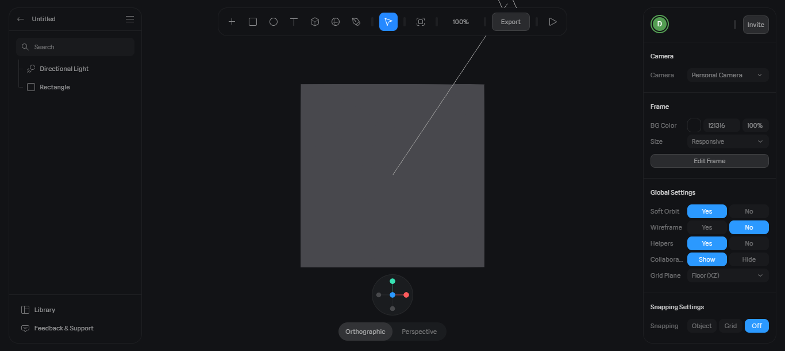

3. Click the box in the scene, and press <kbd>Backspace</kbd>, because we don't need it. We will also delete the directional light later, but keep it for now.
4. New shapes can be added using the **+** icon on the toolbar at the top. Click on it, scroll down and select **Torus**.

   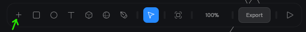
   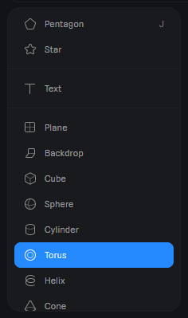

5. Once your cursor turns to a **+**, click anywhere on the screen to place the Torus.

   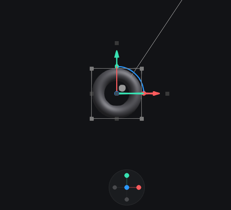

:::note
The camera rotation can be changed by clicking and dragging while holding the <kbd>Alt</kbd> (Windows) or <kbd>Option</kbd> (Mac) key.
:::

7. Center the Torus by right clicking on it, scrolling down and selecting `Reset Position`. Alternatively, you can enter 0 in all three fields of the Position row on the right.

8. Scale the Torus by a factor of two by entering `2` in all three fields of the Scale row.

   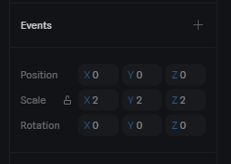

9. You can play around with the different fields in the **Shape** section to modify the Torus, however we will continue with the default properties.

   

10. Scroll down to the **Material** section in the right column, click on the textbox beside the colour picker and enter `3489DC` or any color you like. Effects on the 3D object in Spline are applied as layers, let's add another effect.

11. Click on the **+** icon in the **Material** section, and from the dropdown select **Noise**

    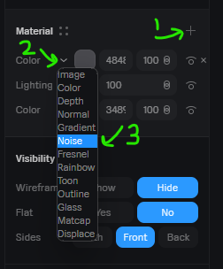

12. You'll notice that the colour you previously chose has been replaced by black and white noise, this is because the noise layer is covering all the layers below it. In order to fix this, click on the icon to the right of 100 in the noise row and select **overlay**.

    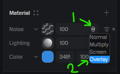

13. Finally, let's change the noise type, just for better visuals. Click on the squiggly lines beside noise, select **Simplex Fractal** and set **Movement** to 2.

    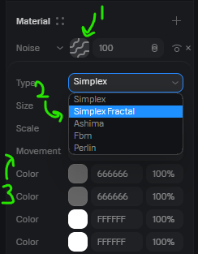

Your 3D model should look like this:

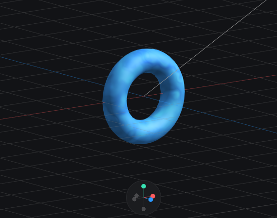

14. Click on **Directional Light** in the left column, and press <kbd>Backspace</kbd> key because we don't need it anymore.
15. Click **Export** in the top menu. Click on the first dropdown and select **Code (Experimental)**. Select **react-three-fiber** in the second dropdown. Finally, click on the Copy icon in the code section to copy the generated code.

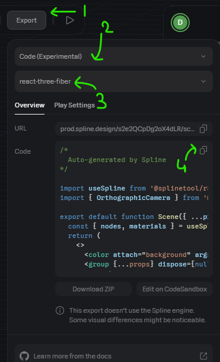

## Animating 3D Model using Remotion

1. Create a new Remotion project from the React Three Fiber template by running `npm init video`.

   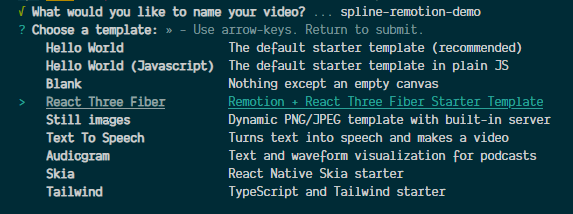

2. Install the [`@splinetools/r3f-spline`](https://github.com/splinetool/r3f-spline) package:

   ```shell
   npm install @splinetool/r3f-spline
   ```

3. Create a new file at `src/Torus.tsx` with the code that you have copied from Spline.
4. Remove the `OrthographicCamera` import, and the `<OrthographicCamera>` component as we will be using the `useThree` hook for the camera.

5. In `src/Scene.tsx`, replace the default scene with:

```tsx twoslash title="src/Root.tsx"
// @filename: src/Torus.tsx
import React from "react";
const Torus: React.FC = () => null;
export default Torus;
// @filename: src/Root.tsx
// ---cut---
// @jsx: react-jsx
import { ThreeCanvas } from "@remotion/three";
import { useVideoConfig } from "remotion";
import Torus from "./Torus";

export const Scene: React.FC = () => {
  const { width, height } = useVideoConfig();

  return (
    <ThreeCanvas width={width} height={height}>
      <Torus />
    </ThreeCanvas>
  );
};
```

7. Add the following imports to `src/Torus.tsx`:

```ts title="src/Torus.tsx"
import React, { useEffect } from "react";
import { useThree } from "@react-three/fiber";
import { interpolate, spring, useCurrentFrame, useVideoConfig } from "remotion";
```

8. Add the following code inside the Torus function below the `useSpline()` call:

```tsx twoslash title="src/Torus.tsx"
import { useCurrentFrame, useVideoConfig } from "remotion";

// ---cut---
const frame = useCurrentFrame();
const { fps, durationInFrames } = useVideoConfig();
```

Position the camera to look at the center point from `200` z offset.

```tsx title="src/Torus.tsx"
const camera = useThree((state) => state.camera);

useEffect(() => {
  camera.position.set(0, 0, -400);
  camera.near = 0.2;
  camera.far = 1000;
  camera.lookAt(0, 0, 0);
}, [camera]);
```

9. Let's add some animation. Below the above code, insert the following:

```tsx twoslash title="src/Torus.tsx"
import { interpolate, spring } from "remotion";
const durationInFrames = 300;
const frame = 0;
const fps = 30;
// ---cut---

const constantRotation = interpolate(
  frame,
  [0, durationInFrames],
  [0, Math.PI * 6]
);

const entranceAnimation = spring({
  frame,
  fps,
  config: {
    damping: 200,
  },
});
```

- `constantRotation` will cause the Torus to rotate forever. Math.PI \* 2 equals a complete 360 degree rotation.
- `entranceAnimation` animates from 0 to 1 over time using a spring animation.

10. Find the `<mesh>` element and replace it's `scale` and `rotation` parameters with:

```tsx
scale={entranceAnimation + 3}
rotation={[constantRotation / 2, constantRotation, 0]}
```

:::note
The X rotation is half of the Y rotation, so for every 2 turns in the Y axis, our Torus will turn once in the X axis.
:::

11. That's it! See a rotating Torus in the Remotion Studio.

12. If you want to export your video to a MP4 video file, run:

```shell
npm run build
```

## Final Result / Generated Video

<SplineVideo />

## See also

- [`@remotion/three`](/docs/three)
- [Remotion Three Template](https://github.com/remotion-dev/template-three)
- [Spline](https://docs.spline.design/)
