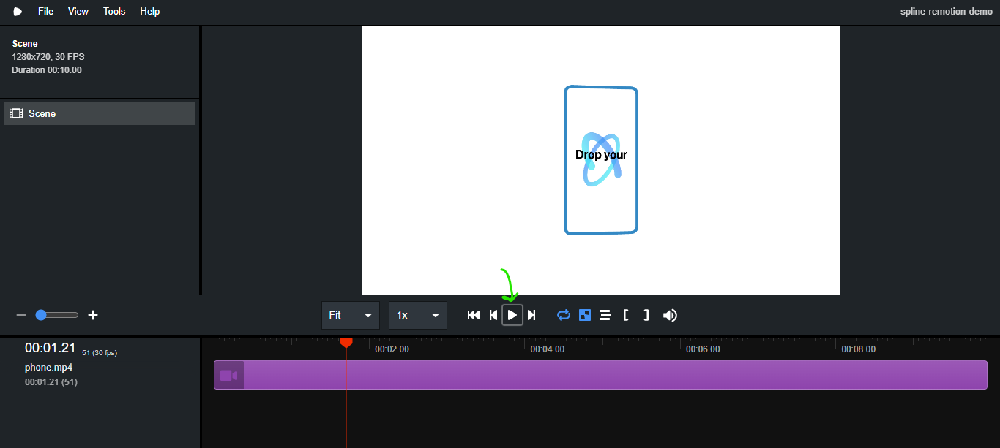

| id     | title                                                                 |
| ------ | --------------------------------------------------------------------- |
| spline | Import design from Spline to Three Fiber code and animate in Remotion |

[Spline](https://app.spline.design/) is a web 3D editor that allows to design 3D models on the web. It allows exporting these models as React Three Fiber code, that can be directly used and animated in Remotion.

In this tutorial, we will first create a simple 3D model in Spline, export it as React Three Fiber code, set up a Remotion project and finally animate that model directly in Remotion and generate a video!

## Create the 3D model in Spline

In this part I will go over all the steps for creating a 3D model in Spline, if you wish to, you can also skip this part and directly access the built model here: https://app.spline.design/file/e954db42-8eb2-4130-a5df-d1a1f9fbdc2a

1. Navigate to https://app.spline.design/ create a new account and login.

2. Click on the `New File` button on the top right to create a new project.

3. Once your project is built, you will see something like this.

   

4. Let's start by clicking on the big square, and pressing the delete button, because we won't be needing that. (We will also delete the directional light later, but keep it for now)

5. New shapes can be added using the **+** icon on the toolbar at the top. Click on it, scroll down and select **Torus**.

   

   

6. Once your cursor turns to a **+** , click anywhere on the screen to place the Torus.

   

Note: The camera rotation can be changed by pressing the **alt (Windows)** or **option (Mac)** key and click and drag to pan the camera.

7. Center the Torus by right clicking on it, scrolling down and selecting **Reset Position**. Alternatively, you can enter 0 in all three fields of the Position row on the right.

8. Scale the Torus to 2 times the original size by entering 2 in all three fields of the Scale row.

   

9. You can play around with the different fields in the **Shape** section to modify the Torus, however we will continue with the default properties.

   

10. Scroll down to the **Material** section in the right column, click on the textbox beside the colour picker and enter `3489DC` (or choose any colour you like!). Effects on the 3D object in Spline are applied as layers, let's add another effect.

11. Click on the **+** icon in the **Material** section, and from the dropdown select **Noise**

    

12. You'll notice that the colour you previously chose has been replaced by black and white noise, this is because the noise layer is covering all the layers below it. In order to fix this, click on the icon to the right of 100 in the noise row and select **overlay**.

    

13. Finally, let's change the noise type, just for better visuals. Click on the squiggly lines beside noise, select **Simplex Fractal** and set **Movement** to 2.

    

14. After following all these steps, your 3D model should look like this:-

    

15. That's it! We're done with the modelling part.
16. Click on **Directional Light** in the left column, and press the delete key because we won't be needing that.
17. Now, to export the model, click on the **Export** button on the top menu. Click on the first dropdown and select **Code (Experimental)**. Click on the second dropdown and select **react-three-fiber**. Finally click on the **copy** icon in the code section to copy the generated code.


## Generated JSX Code of the Spline 3D Model (Torus)

**Note: The generated code is in JavaScript. We will need to convert the code to TypeScript to use it in our Remotion application as we will be using the React Three Fiber template that uses TS. (The conversion is quite simple, and I will do it with explanation later in this tutorial).**

```jsx
/*
  Auto-generated by Spline
*/

import useSpline from "@splinetool/r3f-spline";
import { OrthographicCamera } from "@react-three/drei";

export default function Scene({ ...props }) {
  const { nodes, materials } = useSpline(
    "https://prod.spline.design/s2e2QCpDg2oX4dLR/scene.splinecode"
  );
  return (
    <>
      <color attach="background" args={["#4b4d52"]} />
      <group {...props} dispose={null}>
        <mesh
          name="Torus"
          geometry={nodes.Torus.geometry}
          material={materials["Torus Material"]}
          castShadow
          receiveShadow
          scale={2}
        />
        <OrthographicCamera
          name="1"
          makeDefault={true}
          far={100000}
          near={-100000}
          position={[-175.38, 82.11, -981.07]}
          rotation={[-3.06, -0.18, -3.13]}
          scale={1}
        />
        <hemisphereLight
          name="Default Ambient Light"
          intensity={0.75}
          color="#eaeaea"
        />
      </group>
    </>
  );
}
```

## Animating the RTF 3D Model using Remotion

RTF = React Three Fiber

1. Open a terminal, navigate to the directory where you want to store the Remotion application and run:-

   ```shell
   npm init video
   ```

2. Type a name for your video and press enter.

3. Then you will be asked to choose a starter template, you can start with the **Hello World** template but in this tutorial, we will select the **React Three Fiber** template as it comes preconfigured with the packages that we need, and also some starter code. Use the down arrow key, and press enter on the **React Three Fiber** row.

   

4. Wait for the installer to download all the packages (this might take some time).

5. Navigate to the folder named as the video name that you chose, we will run all further commands from that directory.

6. Run the following commands:-

   ```shell
   npm install @splinetool/r3f-spline
   ```

   We will need the above package since we are using a model generated by Spline. After that, run:-

   ```shell
   npm start
   ```

   This will automatically open a browser window, if not then visit http://localhost:3000

   If you click on the play button, you'll be able to see the video that came prebuilt with the template. (Note: This video is made using code!)

   

7. We will edit the code in the src folder in order to see and animate our 3D model. First of all we need to convert the generated React Three Fiber code from JavaScript to TypeScript as follows:-

   Note: This is NOT the final code, we will add more functionality to this!

   ```tsx
   import useSpline from "@splinetool/r3f-spline";

   export const Torus: React.FC = () => {
     const { nodes, materials } = useSpline(
       "https://prod.spline.design/s2e2QCpDg2oX4dLR/scene.splinecode"
     );

     return (
       <>
         <color attach="background" args={["#ffb703"]} />
         <group>
           <mesh
             castShadow
             receiveShadow
             name="Torus"
             geometry={nodes.Torus.geometry}
             scale={3}
             position={[0, 0, 0]}
             rotation={[0, 0, 0]}
             material={materials["Torus Material"]}
           />
           <hemisphereLight
             name="Default Ambient Light"
             intensity={0.75}
             color="#eaeaea"
           />
         </group>
       </>
     );
   };
   ```

   **Changes made:-**

   1. Removed the `import { OrthographicCamera }... ` line, and the OrthographicCamera component as we will be using the useThree hook for the camera.
   2. Changed the export from default to named, renamed it from Scene to Torus (personal preference) and added type definition to the function.
   3. Changed the background colour from #4b4d52 to #ffb703.
   4. Reordered props. (Shorthand props must be listed before all other props) eslint [react/jsx-sort-props](https://github.com/yannickcr/eslint-plugin-react/tree/master/docs/rules/jsx-sort-props.md)

8. Inside the **src** folder, create a new component called **Torus.tsx** and type/paste the above code.

9. Add the following imports at the **top** of **Torus.tsx**, below the useSpline import.

    ```tsx
    import React, { useEffect } from "react";
    import { useThree } from "@react-three/fiber";
    import { interpolate, spring, useCurrentFrame, useVideoConfig } from "remotion";
    import { CAMERA_DISTANCE } from "./helpers/layout";
    ```

   - useThree is used for the camera.
   - interpolate is used to fill in the frames in between the key frames.
   - spring is used for using spring physics in our animation.
   - useCurrentFrame points the active frame in our video, and useVideoConfig is used to get configuration details (fps and durationInFrames) about our video.

10. Add the following code inside the Torus function, below the `const {node, materials} = useSpline(...)` line:-

    ```tsx
    const frame = useCurrentFrame();
    const { fps, durationInFrames } = useVideoConfig();
    ```

    Below this, add:-

    ```tsx
    const camera = useThree((state) => state.camera);
    useEffect(() => {
      camera.position.set(0, 0, CAMERA_DISTANCE - 550);
      camera.near = 0.2;
      camera.far = 1000;
      camera.lookAt(0, 0, 0);
    }, [camera]);
    ```

    - This is used to generate and position the camera, using which we will look at our 3D model.
    - CAMERA_DISTANCE - 550 is a value which I arrived at after trial and error, you can adjust that as per your needs.
    - camera.lookAt is used to position the camera, (0, 0, 0) means that the camera lens is looking straight ahead.

11. Let's add some animation. Below the above code, insert the following:-

    ```tsx
    const constantRotation = interpolate(
      frame,
      [0, durationInFrames],
      [0, Math.PI * 6]
    );

    const entranceAnimation = spring({
      frame,
      fps,
      config: {
        damping: 2,
        mass: 15,
      },
    });
    ```

    - The constantRotation variable is used to store the number of times our Torus will rotate. Math.PI \* 2 means 1 complete 360 degree rotation. You can increase the number to make the Torus rotate faster.
    - The entranceAnimation uses a spring based animation. This will be more clear when we see the output. Damping controls how many times the spring will compress and extend. A lower value will make the spring compress and extend more. However increasing the mass will cause the spring to compress and extend lesser.

12. Inside the `<mesh ... />` component, replace some lines to utilize the animations which we defined above:-

    Find and replace the following lines:-

    ```tsx
    scale={entranceAnimation + 3}

    rotation={[constantRotation / 2, constantRotation, 0]}
    ```

    - Now the scale (size) of our Torus will be controlled by the spring animation that we defined above.
    - Notice that the X rotation is half of the Y rotation so for every 2 turns in the Y axis, our Torus will turn once in the X axis.

13. Now we are done with the major portion of our code! Just a few minor changes and we'll be able to see our final animation. :D

14. Navigate to **Video.tsx**

    This component is our entire video. A video is made up of one or more compositions (scenes). The props of a Composition component are quite self explanatory. Change the durationInFrames prop from 300 to 210. The length of our video is calculated by durationInFrames/fps.

15. Navigate to **Scene.tsx**

    Remove the `import {Phone} from './Phone';` statement from the top and replace it with

    ```tsx
    import { Torus } from "./Torus";
    ```

    Delete the code from line 36 to line 42 that is:-

    **Replace**

    ```tsx
    <ambientLight intensity={1.5} color={0xffffff} />
    <pointLight position={[10, 10, 0]} />
    <Phone
    	baseScale={baseScale}
    	videoTexture={texture}
    	aspectRatio={videoData.aspectRatio}
    />
    ```

    **With**

    ```tsx
    <Torus />
    ```

    We replaced the Phone component with our Torus component.

16. **That's it!** Navigate to the browser tab that you visited in the beginning and refresh the page. If it is not opening then run `npm start` again. Press the play button and Tadaaaa!

17. If you want to export your video to a mp4 video file, run:

    ```shell
    npm run build
    ```

    The video will be saved in the **out** folder as **video.mp4**

    NOTE: 🔴 <span style={{color: "red"}}>[IMPORTANT] : The above command will **not work** when you are using **@react-three/fiber v7.0.0** because of some error in the library itself. The template which we utilized is using @react-three/fiber v7.0.0. **Upgrade to v8.0.0** and the video gets exported without any issues.</span>

    So, you will have to manually upgrade @react-three/fiber by either editing **package.json** and running **npm install** OR by running **npm install @react-three/fiber@8.0.0**

    v7 throws an error stating "Cannot read properties of null (reading 'precision') at node_modules/three/build/three.module.js:14569"

## Final Result / Generated Video

https://user-images.githubusercontent.com/51107639/197317646-9e4532a1-9a6f-427f-9a99-5fe3d3d31873.mp4

## Additional Resources

https://www.remotion.dev/docs/

https://www.remotion.dev/docs/three

https://github.com/remotion-dev/template-three

https://docs.spline.design/

https://www.youtube.com/c/splinetool
