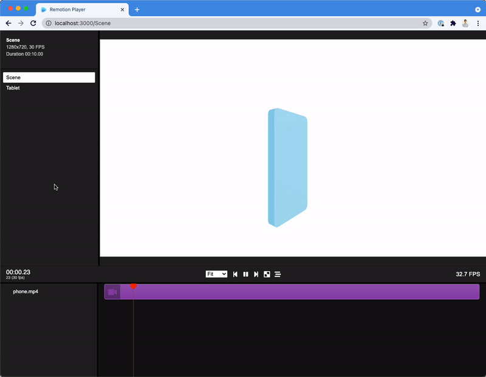

# Remotion + React Three Fiber Starter Template

<p align="center">
    
</p>

[This is a template repository, click "Use this template" to create a repository based off this template!](https://github.com/JonnyBurger/remotion-template-three/generate)

This is a lightweight boilerplate for [Remotion](https://github.com/jonnyburger/remotion) with [React Three Fiber](https://github.com/pmndrs/react-three-fiber) and [@remotion/three](http://remotion.dev/docs/three) preinstalled.

- [Remotion documentation](https://remotion.dev)
- [React Three Fiber documentation](https://docs.pmnd.rs/react-three-fiber)
- [@remotion/three documentation](http://remotion.dev/docs/three)

This example features a phone with a screen. You can easily switch out the video and change a series of parameters, like size, color, aspect ratio, corner radius etc. of the phone.

You can also simply delete everything inside the canvas to start off with your own 3D project.

## Commands

**Install Dependencies**

```console
npm install
```

**Start Preview**

```console
npm run dev
```

**Render MP4 video**

```console
npx remotion render
```

**Upgrade Remotion**

```console
npx remotion upgrade
```

## Docs

Get started with Remotion by reading the [fundamentals page](https://www.remotion.dev/docs/the-fundamentals).

## Help

We provide help on our [Discord server](https://discord.gg/6VzzNDwUwV).

## Issues

Found an issue with Remotion? [File an issue here](https://github.com/JonnyBurger/remotion/issues/new).

## License

Note that for some entities a company license is needed. [Read the terms here](https://github.com/remotion-dev/remotion/blob/main/LICENSE.md).

The content of this template is licensed under MIT.
